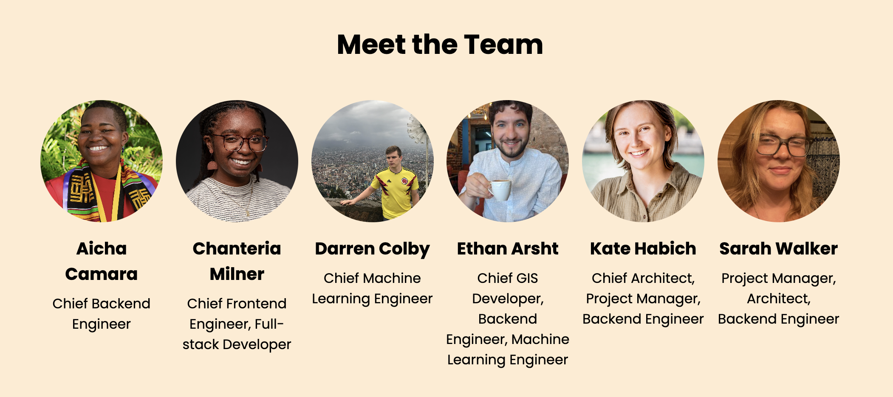

# Shoulder To Shoulder

A web application created to combat social isolation and fight the loneliness epidemic by fostering meaningful connections.

## About The Application

In 2023, the United States Department of Health and Human Services acknowledged a profound challenge affecting millions: loneliness and social isolation have reached epidemic levels in America. This growing health concern has profound implications, as loneliness can impact mental and physical health significantly. At Shoulder to Shoulder, we are committed to addressing this silent epidemic through the power of community and connection.

Our platform is designed not just as a tool, but as a community builder that enables individuals to find and connect with like-minded people in their local area. We believe that meaningful social interactions are a key to improving personal well-being and overall community health. Shoulder to Shoulder offers a dynamic space where users can easily schedule activities and explore new places within their city, fostering real-world connections that go beyond digital interactions.

We facilitate a variety of events and activities, from hiking groups and book clubs to art classes and tech meetups. Our goal is to make it easier than ever for people to engage in shared interests and hobbies, which are crucial for building strong social ties. Whether you're new to the city, seeking to expand your social circle, or simply looking to explore new interests, Shoulder to Shoulder serves as your gateway to a more connected and fulfilling life.

Join us in combating loneliness by engaging in your community through Shoulder to Shoulder. Let's rediscover the joy of connection together, one event at a time.

## UI/UX (User) Tutorial 

<!-- INSERT HERE -->


## How To Run Our App

To open and use the application, first clone the repository to your local machine, and navigate to the `ShoulderToShoulder` directory in your terminal. 

Next, you will need to set up and launch both the frontend module and the backend module at the same time in order to get the frontend and backend working in tandem. Follow these steps in your terminal:

<pre>
```
brew install nodejs
cd frontend
npm install -g @angular/cli
npm install
cd s2s
ng serve
```
</pre>

Navigate to `localhost:4200/` in your web browser. 

Now, open a new terminal and run:

<pre>
```
cd backend
poetry env use 3.12
poetry shell
poetry install
python shoulder/manage.py runserver
```
</pre>

Navigate to `localhost:8000/data` in a new tab in your web browser and enter the superuser log-in credentials.

Now, you can interact with the app through the frontend `localhost:4200/` browser, and your responses and data will be saved in real time to the `localhost:8000/data` backend browser. 

To exit the application, run ctrl+C (i.e. ^C) in both terminals to shut down the local hosts.

## Running Our App On The Server

<!-- TBD -->

## Meet the Team



- Aïcha Camara
    - Aïcha is a second year Master's student at the University of Chicago. They are passionate about exploring Chicago and interested in finding new places to hike or eat tasty food around the city.
- Chanteria Milner
    - Chanteria is a second year Master's student studying computational analysis and public policy. When she is not coding for the U.S. Census Bureau, Chanteria enjoys finding new knitting patterns, buying too many books, and petting her cat, Clover.
- Darren Colby
    - Darren is a second year Master's student at the University of Chicago. He is excited to apply his data science skills to difficult public policy challenges and spends his free time swimming and excercising.
- Ethan Arsht
    - Ethan is a second year graduate student at the University of Chicago. He likes biking, baking, board games, building things, and alliteration.
- Kate Habich
    - Kate is a second year Master's student at the University of Chicago studying comutational analysis and public policy with a focus on environmental issues. They enjoy picking up new hobbies and skills including crochetting, writing, and spending time outdoors.
- Sarah Walker
    - Sarah is a second year Master's student at the University of Chicago. As a student it can be difficult for her to find time to invest in her social life; she also finds it difficult to meet new people and try new things on such a tight schedule. She is glad to be working on a project aimed at connecting others who may feel lonely or stuck in their daily routines.


