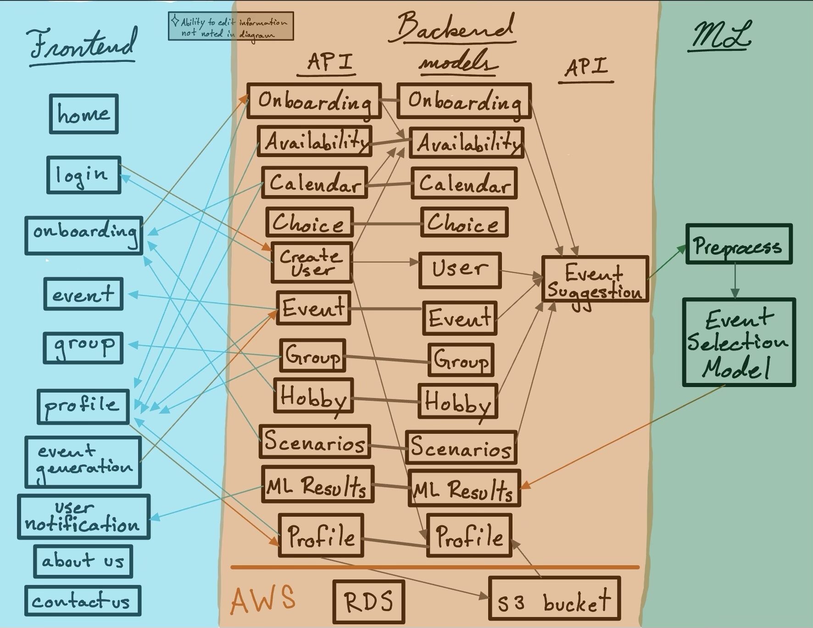

# ShoulderToShoulder Architecture Documentation

## Repository Contents

#### `frontend`
Directory with our web application's frontend development, which is created to display information and interact with users. Our frontend employs Angular.

#### `backend/shoulder` 
Directory with our web application's backend development. Our backend employs Django with an AWS posgress database. The database contains account information, user data, and event data. The backend development team manages the database, the API endpoints, and involves a machine learning component. 

#### `backend/shoulder/ml`
Directory which contains our web application's machine learning development. Machine learning is used by our application to provide users with recommendations for events to attend.

To generate user recommendations, we employ a deep factorization machine (DeepFM). See our repo README.md for more details. 

#### `backend/shoulder/GIS`
Directory which contains our web application's GIS module. We use spatial analysis to locate events happening in a user's area. 

#### Dependency Graph and Model of Our Data Flow

Our data is sourced from user inputs. When users sign up for our application, they go through an onboarding process in order to create their account. The onboarding collects three types of information: demographic information, logistics about their interests and availability, and an event preference survey. User responses get saved as data into our database. This is the data that our machine learning model uses to generate personalized event recommendations for users. 

Once users begin attending events, their experiences will be tracked on their profile. Records of the events that users attend and any feedback they provide about these events (for ex., their rating of the event) become additional data that get saved in our database and used by our model to improve recommendations.  




## New Member Onboarding

After cloning the repository to your local machine, you will need to set up the virtual environment and install necessary dependencies in order to begin developing. 

### Virtual Environments

#### `frontend`

The frontend development uses `npm` as its package manager. To use npm, you first need to install [nodejs](https://nodejs.org/en). (follow the installation instructions provided on the nodejs website, or run `brew install nodejs` in your terminal). Afterward, to install the necessary packages, follow these steps:

<pre>
```
cd frontend
npm install -g @angular/cli
npm install
```
</pre>

This process only needs to be done once. Once the packages have been installed, `cd frontend` at any time to develop in the frontend. 

#### `backend`

The backend employs a poetry virtual environment with Python 3.12. To create the environment for the first time, follow these steps:
 
<pre>
```
cd backend
poetry env use 3.12
poetry shell
poetry install 

#to exit the environment
exit
```
</pre>

If you have already created the poetry environment once before, you will need to enter it every time you develop in the backend. Follow these steps to open the environment: 

<pre>
```
cd backend
poetry env use 3.12
poetry shell

#to exit the environment
exit 
```
</pre>

### How to use our app

To use the application, you will need to launch both the frontend module and the backend module at the same time in order to get the frontend and backend working in tandem. Follow these steps in the terminal:

<pre>
```
cd frontend/s2s
ng serve
```
</pre>

Navigate to `localhost:4200/` in your web browser. 

Now, open a new terminal and run:

<pre>
```
cd backend
poetry env use 3.12
poetry shell
python shoulder/manage.py runserver
```
</pre>

Navigate to `localhost:1800/` in your web browser and enter the superuser credentials.

To exit the application, run ctrl+C (i.e. ^C) in both terminals to shut down the local hosts.

### Pre-Commit Checklist

Before merging your code, it needs to be properly formatted. Follow these steps (for each development module) to pass pre-commit.

#### `backend`: 

<pre>
```
cd backend
pre-commit run --all
```
</pre>

#### `frontend`: 

<pre>
```
cd frontend
npm run lint
npm run format
```
</pre>
