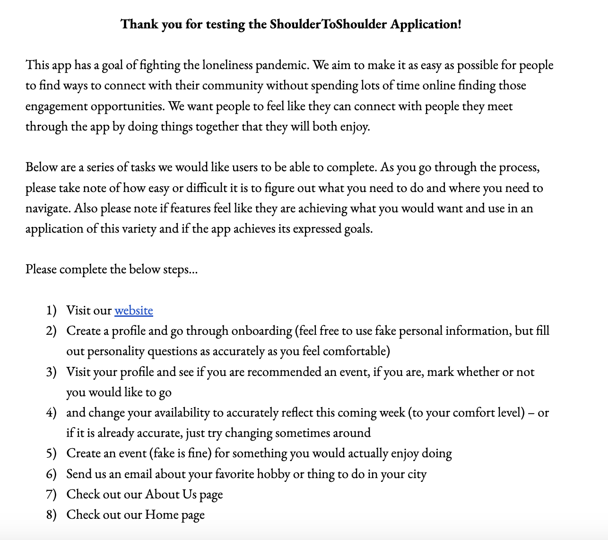

# ShoulderToShoulder User Experience Documentation

## Methodology
We conducted two rounds of user experience testing. One round was conducted before we began to earnestly outline our project. We conducted this first round in order to gain people's opinions on the issue we hoped to alleviate, which is the loneliness pandemic. We asked people what they would want in a tool which allowed them to connect more deeply with their community. Once we had formulated our project from the team's goals and our user feedback, we created the base product and built out a few special features such as emailing capabilities. 

At this point, we conducted our second round of user testing. We reached out to 4 potential users (some repeats from the first round, some new users) and asked them to walk through a series of tasks (pictured below) on the website to determine the intuitiveness of our interface and the sticking points for users. We also asked for feedback on how well our tool accomplished the stated goals of the project. Further, we sought feedback on further features that users would find useful. 

## Results

### Round 1
Interviewees affirmed that their favorite way to make friends is through shared interests and activities. They indicated wanting to have more information provided about events like the estimate cost. We collected ideas from interviewees of the hobbies and activities they would be interested in having included on the website. This process generally confirmed that our project concept was on the right track and got us thinking baout some details that we hadn't yet considered. 

### Round 2
The second round testing was extremely valuable in understandig the strenghts and deficiencies of our project, but in most cases there was not time to implement this feedback before the deadline. Thus, these results inform our future work most significantly. 

Testers completed the tasks outlined and caught a few typos and sticking points. Pieces of the login, onboarding, and profile editing process were not as intuitive as we originally believed. Testers were confused when the onboarding did not submit when they clicked their response on the last scenario, failing to notice the 'Submit' below. Testers did not like that the 'Contact Us' form opened an email in their computer's default email location rther than sending directly from the app. Testers were confused if their profile image had uploaded due to the lack of a confirmation message. The users generally had a very positive reaction to the aesthetics of the user interface and found most desired information was present and in the expected locations.

We asked testers to fill out the onboarding information how they would in real life (with the exception of email and phone number), but found that most users chose to specify 'No Preference' or "Prefer Not to Say' on most demographic information. 

Testers expressed that they worried about being able to find the people they were meeting up with once they were on their way to the event. To alleviate these concerns, we implemented an event email, which sends users an email containing all information related to their event, so that they can reference this rather than trying to lgo into the app on their phone when they may be off wifi. We also altered the language in the 'Event Creator' form to request that creators add information about the specific location the group plans to meet. For example, if a user is attending a food festival, the creator may mention a specific street corner or vendor to meet at or if users intend to attend a concert, the creator may mention their seat number so that other attendees can purchase seats in the same section. 

## Future Work

Many features in this section are based on user interviews and the features they mentioned would enhance their experience on or off the app. Others are based on features the team wished they had time to build as they were working on the project.

1) 'User Created Events' page, which displays all events that a user has created on Shoulder to Shoudler
2) 'Connected Events' functionality, which allows users to attach their own events to major public events like football games or concerts. People that are plannign to attend those public events can search for an associated event so that they can meet people and bond over the original event. Examples of this functionality include a tailgating event attached to a football game and meeting at a late night cafe after a concert to talk about the experience. 
3) 'Blocking/Reporting Users' feature, which woudl allow users to guarantee that they will not be grouped with another app user in the future who they had a negative experience with. This may also be information that is collected by the Shoulder to Shoulder team in case a user needs to be removed from the platform for inappropriate conduct. 
4) 'Rainy Day' button, which would provide a new event day-of if the weather is too bad to be able to do your original outdoor event. 
5) Calculating travel time for users to an event based on their prefered mode of transportation.